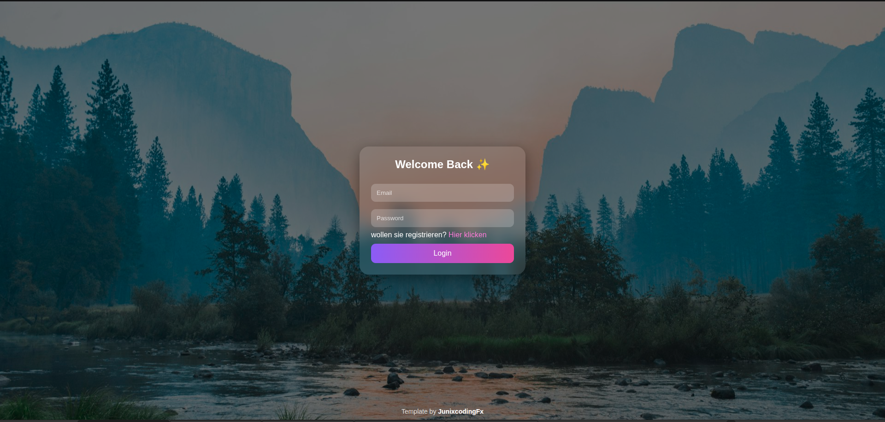

# JunixLogin
  
  
  

JunixLogin ist eine moderne Login-Oberfläche mit klarem Fokus auf Design und Benutzerfreundlichkeit.  
Das Projekt ist bewusst einfach gehalten und basiert ausschließlich auf HTML und CSS, wodurch es leicht in bestehende Projekte integriert werden kann.

***

## Preview



## Features

* Modernes Glassmorphism-Design
* Vollständig responsive für Mobile und Desktop
* Sanfte Animation beim Laden
* Klar strukturierter Code
* Leicht anpassbar für eigene Projekte

***

## Installation

Repository klonen:

```bash
git clone https://github.com/JunixcodingFx/JunixLogin
```

Danach einfach öffnen:

```bash
index.html
```

Keine weiteren Abhängigkeiten notwendig.

***

## Anpassung

Das Design kann problemlos angepasst werden:

* Hintergrundbild ändern (CSS im body)
* Farben des Buttons anpassen
* Texte im HTML bearbeiten
* Zusätzliche Funktionen integrieren

***

## Struktur

```
JunixLogin/
│
├── Login.html
├── preview.png
└── README.md
```

***

## Verwendung

Dieses Projekt kann frei verwendet werden als:

* Grundlage für eigene Login-Systeme
* Template für Webseiten
* Lernprojekt im Bereich Frontend

***

## License

This project is licensed under the MIT License.

You are free to use, modify, and distribute this project for both personal and commercial use.  
Changes of any kind are allowed without restriction.

The only requirement is that the original author is mentioned in the project.

The software is provided "as is", without warranty of any kind.

## Contributors

- [jonathan.t](https://github.com/JunixcodingFx)  
- [mjadventurehost](https://github.com/mjadventurehost)

***

## Author

JunixFx  
<https://github.com/JunixcodingFx>
